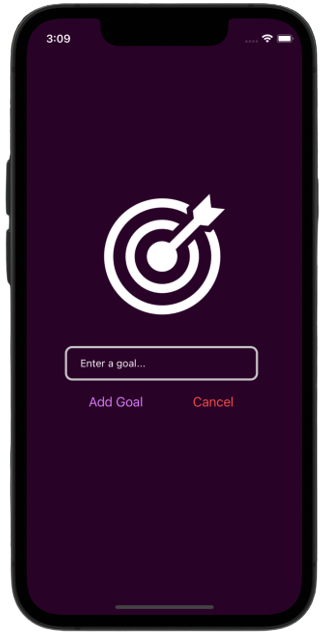
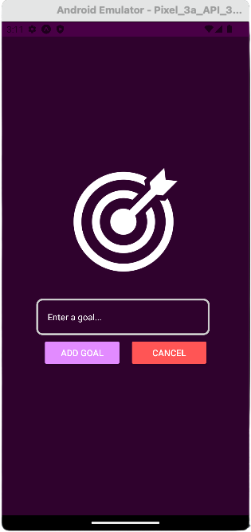
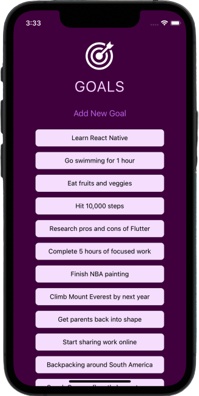
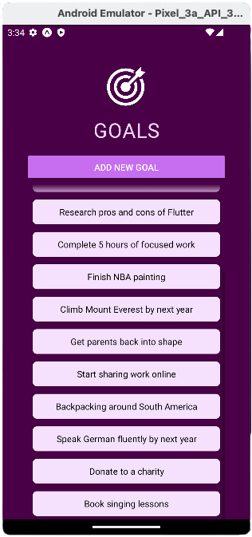
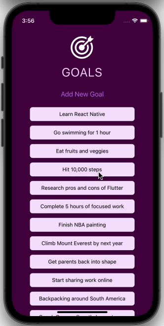
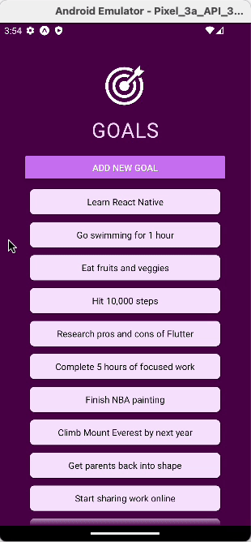

# Goals
My first ever mobile application! Goals is built with React Native, which supports iOS, Android! Users can add and remove goals, and see and scroll their list of added goals.

## Application Walkthrough:
#### Input Goal Modal (iOS & Android)
<p align="center">
  
  &ensp;
  
</p>

#### All Goals Display (iOS & Android)
- Observe Android's `fadingEdgeLength` (list top) to indicate more scroll elements
<p align="center">
  
  &ensp;
  
</p>

#### Deleting and Adding Goals (iOS & Android)
- Observe the `android_ripple` effect upon press/delete
<p align="center">
  
  &emsp;
  
</p>


## Installation:
This app is not published to the App Store or Google Play yet. To run locally:
  - `cd` into this project repo, then run `npm start`
  - To view on your device:
      - Install "Expo Go" from the AppStore or Google Play
      - Scan the QR code shown in the terminal with Expo Go (Android) or the Camera app (iOS)
  - To view on your laptop/desktop (via a iOS Simulator or Android Emulator)
    - Type `i` for the iOS Simulator (must have XCode installed) or `a` for the Android Emulator (must have [Android Studio](https://developer.android.com/studio) installed and a PlayStore-compatible device emulator running)
    - (`shift + i` or `shift + a` to toggle between different device versions/models)

## Code Snippets
#### 1. Goal Input Modal (Slide up overlay) [[code]](https://github.com/emilydaykin/Goals/commit/ce715da5e56c1ef183361a818a8b36aa6338a3b7)
  ```javascript
  return (
    <Modal visible={modalIsVisible} animationType='slide'>
      <View style={styles.inputContainer}>
        <TextInput
          placeholder='Your goals'
          style={styles.textInput}
          onChangeText={goalInputHandler}
          value={goalInput}
        />
        <Button title='Add Goal' onPress={addGoalHandler} />
      </View>
    </Modal>
  );
  ```

#### 2. Adding press functionality to each added/displayed goal via the `Pressable` component (as well as `.bind`), which will delete the goal [[code]](https://github.com/emilydaykin/Goals/commit/ee3ff50284d9f78d63039b017ac2ceb0c04cb917)
  ```javascript
  <Pressable
    android_ripple={{ color: '#8d38fc' }}
    onPress={onDeleteGoal.bind(this, itemData.item.key)}
    style={({ pressed }) => pressed && styles.pressedItem}
  >
    <Text style={styles.goalText}>{itemData.item.text}</Text>
  </Pressable>
  ```


#### 3. `FlatList` instead of a `ScrollView` to improve performance by only rendering elements as needed [[code]](https://github.com/emilydaykin/Goals/commit/39185a4cc59575c3232d7fd31651a1334210dcc9)
  ```javascript
  <FlatList
    data={goals}
    renderItem={(itemData) => {
      return <Text style={styles.goalItem}>{itemData.item.text}</Text>;
    }}
    keyExtractor={(item, index) => {
      return item.id;
    }}
    alwaysBounceVertical={false}
    fadingEdgeLength={50}
  />
  ```

#### 4. `ScrollView` instead of a plain `View` to enable scrolling [[code]](https://github.com/emilydaykin/Goals/commit/be89a7e2beba9bb7aab2d12e8ffe43507f32b88b)
  ```javascript
  <ScrollView alwaysBounceVertical={false}>
    {goals.map((goal, _id) => (
      <Text style={styles.goalItem} key={_id}>
        {goal}
      </Text>
    ))}
  </ScrollView>
  ```

#### 5. `Button` element styling by wrapping a `View` around it, and using stylesheet objects [[code]](https://github.com/emilydaykin/Goals/blob/main/components/GoalInput.js)
  ```javascript
  <View style={styles.button}>
    <Button title='Cancel' onPress={onCancel} color='#ff5555' />
  </View>

  ...

  const styles = StyleSheet.create({
    ...
    button: {
      margin: 10,
      width: '30%',
      color: '#ffffff',
    }
  });
  ```